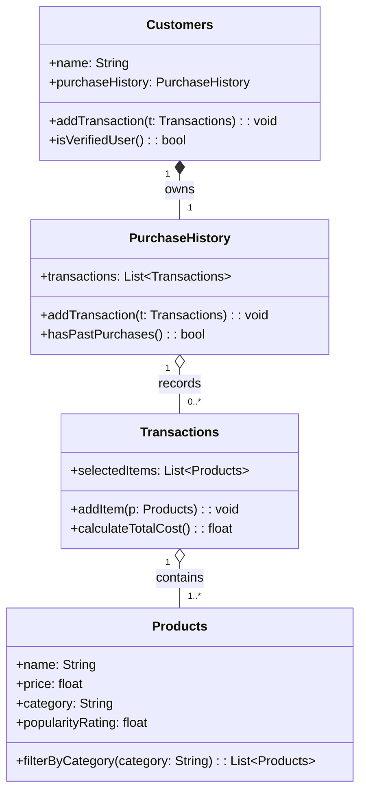

# ByteBites UML Design

```mermaid
classDiagram
class Customers {
  +name: String
  +purchaseHistory: PurchaseHistory
  +addTransaction(t: Transactions): void
  +isVerifiedUser(): bool
}

class PurchaseHistory {
  +transactions: List~Transactions~
  +addTransaction(t: Transactions): void
  +hasPastPurchases(): bool
}

class Products {
  +name: String
  +price: float
  +category: String
  +popularityRating: float
  +filterByCategory(category: String): List~Products~
}

class Transactions {
  +selectedItems: List~Products~
  +addItem(p: Products): void
  +calculateTotalCost(): float
}

Customers "1" *-- "1" PurchaseHistory : owns
PurchaseHistory "1" o-- "0..*" Transactions : records
Transactions "1" o-- "1..*" Products : contains
```
