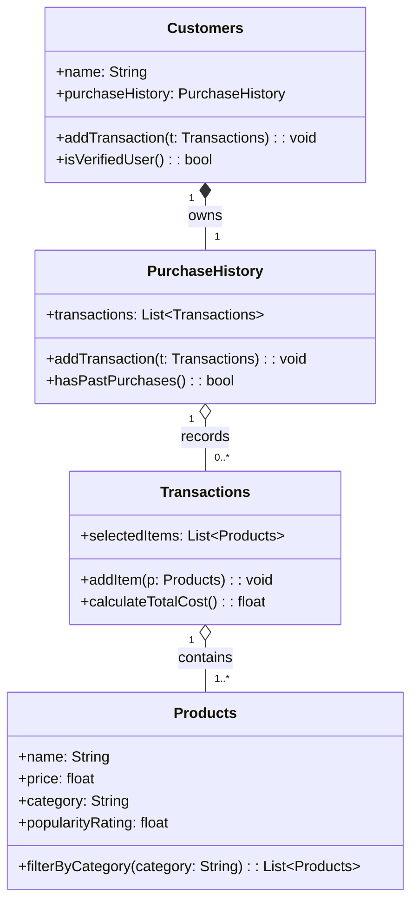

# ByteBites UML Design

## Class Roles

- **Customers**: Represents an app user with a name and linked purchase history. It can add new transactions and determine whether the user is verified by checking prior purchases.
- **PurchaseHistory**: Stores a customer’s list of past transactions. It supports adding transactions and checking whether any purchases exist.
- **Products**: Represents a menu item with core details (name, price, category, popularity). It includes category-based filtering behavior for browsing.
- **Transactions**: Groups selected products into a single purchase event. It supports adding items and calculating the total transaction cost.
