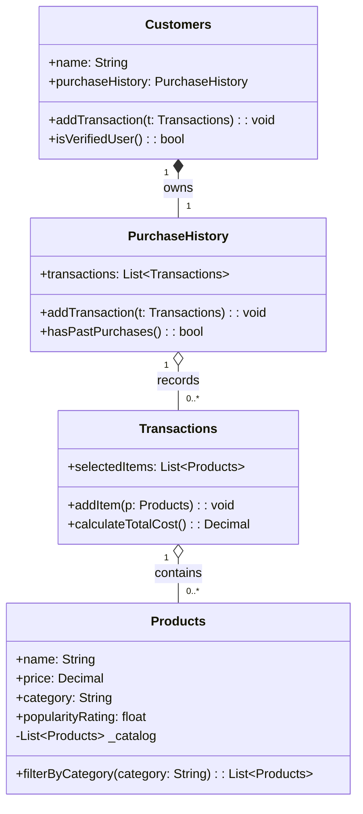

# ByteBites UML Design

```mermaid
classDiagram
class Customers {
  +name: String
  +purchaseHistory: PurchaseHistory
  +addTransaction(t: Transactions): void
  +isVerifiedUser(): bool
}

class PurchaseHistory {
  +transactions: List~Transactions~
  +addTransaction(t: Transactions): void
  +hasPastPurchases(): bool
}

class Products {
  +name: String
  +price: Decimal
  +category: String
  +popularityRating: float
  -List~Products~ _catalog
  +filterByCategory(category: String): List~Products~
}

class Transactions {
  +selectedItems: List~Products~
  +addItem(p: Products): void
  +calculateTotalCost(): Decimal
}

Customers "1" *-- "1" PurchaseHistory : owns
PurchaseHistory "1" o-- "0..*" Transactions : records
Transactions "1" o-- "0..*" Products : contains
```

## Design Notes

- The `Products` class uses a single in-memory catalog stored in `_catalog`, which acts as the system's item registry and keeps filtering and sorting behavior in one place.
- A separate `Menu` class would duplicate the same product data and create two sources of truth; `_catalog` keeps the catalog authoritative while still supporting category-based browsing.
- Monetary values are modeled as `Decimal` so totals are precise and stable instead of relying on floating-point rounding.

## Class Roles

- **Customers**: Represents an app user with a name and linked purchase history. It can add new transactions and determine whether the user is verified by checking prior purchases.
- **PurchaseHistory**: Stores a customer’s list of past transactions. It supports adding transactions and checking whether any purchases exist.
- **Products**: Represents a menu item with core details (name, price, category, popularity). It includes category-based filtering behavior for browsing.
- **Transactions**: Groups selected products into a single purchase event. It supports adding items and calculating the total transaction cost.
