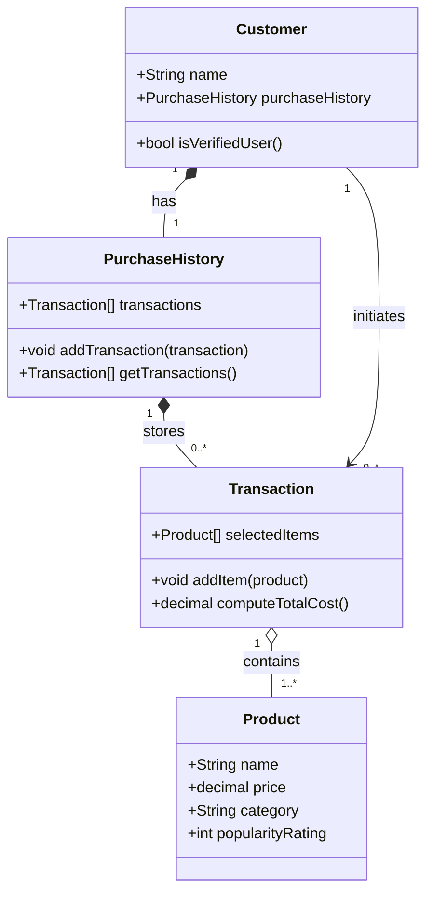

# ByteBites UML Class Diagram (Draft)

Source: bytebites_spec.md (Customer management, product fields, item collection/filtering, and transaction total-cost behavior).

Assumptions:
- Class names are normalized to singular UML style from the provided candidate list.
- Relationships and multiplicities include sensible inferences from the feature request text.