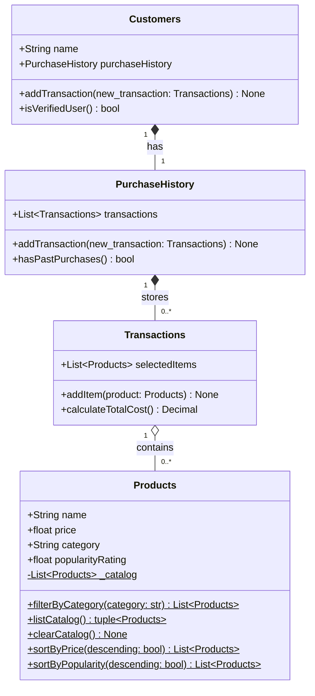

**Relationship notes:**
- `Customers ──* PurchaseHistory` — composition; a customer owns exactly one history
- `PurchaseHistory ──* Transactions` — composition; history is nothing without its transactions
- `Transactions ──o Products` — aggregation; items exist independently in the catalog, a transaction just references them

The `$` marker on `Products` methods denotes class-level (`@classmethod`) operations, since the catalog is a `ClassVar` shared across all instances.