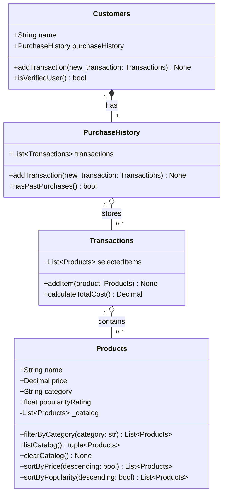

```mermaid
classDiagram
    class Products {
        +String name
        +Decimal price
        +String category
        +float popularityRating
        -List~Products~ _catalog
        +filterByCategory(category: str) List~Products~
        +listCatalog() tuple~Products~
        +clearCatalog() None
        +sortByPrice(descending: bool) List~Products~
        +sortByPopularity(descending: bool) List~Products~
    }

    class Transactions {
        +List~Products~ selectedItems
        +addItem(product: Products) None
        +calculateTotalCost() Decimal
    }

    class PurchaseHistory {
        +List~Transactions~ transactions
        +addTransaction(new_transaction: Transactions) None
        +hasPastPurchases() bool
    }

    class Customers {
        +String name
        +PurchaseHistory purchaseHistory
        +addTransaction(new_transaction: Transactions) None
        +isVerifiedUser() bool
    }

    Customers "1" *-- "1" PurchaseHistory : has
    PurchaseHistory "1" o-- "0..*" Transactions : stores
    Transactions "1" o-- "0..*" Products : contains
```

**Relationship notes:**
- `Customers ──* PurchaseHistory` — composition; a customer owns exactly one history
- `PurchaseHistory ──o Transactions` — aggregation; history records transactions without owning the item catalog itself
- `Transactions ──o Products` — aggregation; items exist independently in the catalog, and a transaction holds zero or more selected items

**Design note:** the `_catalog` field replaces a separate `Menu` class because the menu is really just the product registry itself. Keeping that list on `Products` avoids duplicating item data and keeps category filtering, sorting, and browsing logic in a single source of truth.
